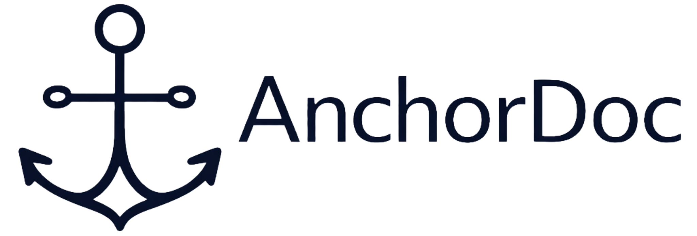

# AnchorDoc

Upload a document → anchor its hash on IOTA → verify integrity later.

**IOTA × Masterz Hackathon MVP** built with [IOTA Notarization](https://github.com/iotaledger/notarization).

AnchorDoc is a **proof-of-delivery notarization system** for transport documents (e.g. DDTs).
It makes documents **tamper-evident over time** without storing them on-chain.

---

## Tech Stack

**Frontend**
- React + TypeScript + Vite + Tailwind

**Backend**
- Node.js + Express + TypeScript
- SQLite (better-sqlite3)
- IOTA SDK + Notarization

---

## Run Locally

> Run **backend and frontend together** (two terminals)

### 1. Clone
```bash
git clone https://github.com/dumitrescuvlad/AnchorDoc.git
cd AnchorDoc
```
---

### 2. Install
```bash
cd backend && npm install
cd ../frontend && npm install
```
---

### 3. Setup environment
```bash
cp backend/.env.example backend/.env
cp frontend/.env.example frontend/.env
```
#### Quick start (recommended)

MOCK_NOTARIZATION=true

→ No IOTA setup required
→ App works immediately end-to-end

#### Full IOTA mode (optional)

Set:

MOCK_NOTARIZATION=false

and configure:
```bash
- IOTA_NOTARIZATION_PKG_ID
- IOTA_MNEMONIC
```
---

### 4. Run
```bash
Terminal 1 — Backend:
cd backend
npm run dev

Terminal 2 — Frontend:
cd frontend
npm run dev
```
---

### 5. Access

Frontend → http://localhost:5173
Backend → http://localhost:4000
Health check → http://localhost:4000/health

---

## What to test

1. Upload a document
2. Notarize it
3. Verify integrity
4. Modify the file → verification should fail

---

## Notes

- Ensure `.env` files exist before starting
- VITE_API_BASE must match backend PORT (default: 4000)
- SQLite DB and upload folders are created automatically
- Mock mode allows full testing without IOTA configuration
